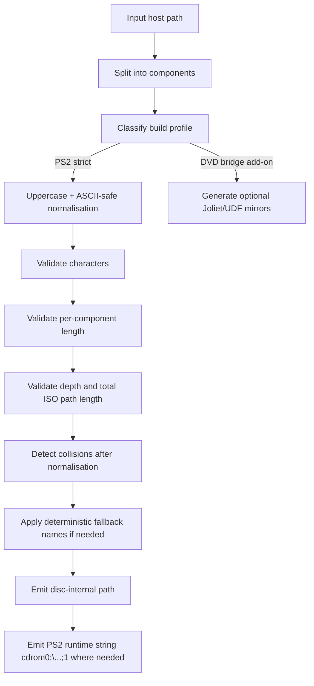

# Disc Path Rules for Exporters

## Executive summary

For a PS2 exporter, the safest working assumption is that the console-side tooling and boot path handling care about the **ISO 9660 primary namespace**, not about whatever friendlier filename view a host OS may show. In practice that means: author names as **upper-case**, restrict them to the classic ISO character set unless you have a very specific reason not to, keep the hierarchy shallow, think in **2048-byte logical blocks**, and generate PS2 runtime strings in the familiar form `cdrom0:\PATH\FILE.EXT;1` when serialising boot and loader paths. DVD images may also carry a **UDF 1.02 bridge**, but public PS2 boot syntax is still ISO-style, and the conservative exporter target is therefore the ISO side first, everything else second. citeturn48search3turn20view0turn33view0turn46search1

The reason so many PS2 examples use **ALL CAPS** is not that the console invented a special “PS2 uppercase rule”. It is mostly the natural consequence of ECMA-119 / ISO 9660 primary naming rules and the behaviour of mastering tools that target those rules: the portable primary namespace uses upper-case letters, digits and underscore, while lowercase and relaxed forms are explicitly treated by common mastering tools as non-compliant or extension-only behaviour. Public PS2 examples then inherit that convention, including `SYSTEM.CNF` boot strings such as `BOOT2 = cdrom0:\SCPS_110.04;1`. citeturn45search0turn26view1turn26view4turn48search3

You should also separate **disc-internal files** from **disc-image container formats**. A file actually stored on a PS2 disc can perfectly well be called something like `IOPRP300.IMG` or `DATA.BIN`, because the filesystem only cares that the identifier is legal. By contrast, `.ISO`, `.BIN/.CUE`, `.MDF/.MDS`, `.IMG/.CCD/.SUB`, `.NRG`, `.CSO`, `.GZ` and similar names are normally **host-side image or container formats**, not special PS2 in-disc path types. `.PS2` is another good example of ambiguity: on public PS2 preservation/tooling pages it is a **1:1 PS2 memory-card archive extension**, not an optical-disc path convention. citeturn43view0turn48search1turn48search0

The exporter conclusion is straightforward: if your goal is “works on the widest range of PS2 disc consumers, loaders and rebuild workflows”, validate against a **strict ISO namespace profile first**, then optionally emit Joliet/UDF mirrors for PC convenience on DVD builds. citeturn20view0turn33view1turn48search3

## What the PS2 actually reads

There are really **two path syntaxes** you need to keep distinct. The first is the **disc-internal path hierarchy** recorded in the optical filesystem. The second is the **runtime device path** used by PS2 software, most visibly in `SYSTEM.CNF`, where public documentation shows entries such as `BOOT2 = cdrom0:\SCPS_110.04;1`. That string tells you several things at once: `cdrom0:` is the optical-drive device prefix; `\` is the conventional separator in that runtime syntax; and `;1` is the ISO file version suffix rather than a host-OS filename extension. citeturn48search3turn29view1

Public emulator and preservation documentation describes PS2 game discs as **unencrypted CDs and DVDs**. The same material says PS2 **DVDs are typically ISO 9660 with UDF 1.02**, while PS2 **CDs are simply ISO 9660**. That wording matters: it means “DVD build” and “PS2 runtime path syntax” are not the same question. A DVD may carry a UDF bridge for broader compatibility, but the console-facing path examples and boot strings still use the ISO-style namespace. citeturn32view0turn33view0turn20view0turn39view0

For exporter design, that implies a useful mental model: store your canonical asset tree internally as neutral paths such as `MODULES/PADMAN.IRX`, but when you serialise PS2-facing strings for `SYSTEM.CNF`, launchers or module loading, emit `cdrom0:\MODULES\PADMAN.IRX;1`. Treat the ISO view as the **authoritative console view**, even on DVD builds that also include UDF. citeturn48search3turn20view0turn33view1

## Naming rules and case behaviour

In the ISO 9660 primary namespace, the legal filename character repertoire is intentionally small. GNU libcdio summarises **d-characters** as `A-Z`, `0-9` and `_`, while ECMA-119 defines the filename structure with two special separators: `.` (separator 1, byte `2E`) between name and extension, and `;` (separator 2, byte `3B`) before the file-version number. Put differently, a primary ISO file identifier is not “arbitrary text plus extension”; it is a structured identifier with a name part, optional extension part, and version part. citeturn45search0turn45search3turn29view1

At **ISO 9660 Level 1**, ECMA-119 constrains the file name to at most **8 d-characters**, the extension to at most **3 d-characters**, and a directory identifier to at most **8 d-characters**. At **Levels 2 and 3**, ECMA-119 relaxes this to a file-name-plus-extension total of **30 d-characters**, and directory identifiers up to **31 d-characters**. Tooling such as `mkisofs` commonly summarises that visible filename limit as **31 characters**, because the displayed identifier also includes the `.` separator; Level 3 additionally allows multi-extent files. citeturn29view2turn2view1turn26view0turn26view1

The familiar “everything on PS2 is uppercase” look follows directly from those rules. Common mastering tools say that, for ISO-9660 Levels 1–3, filenames are restricted to **upper-case letters, numbers and underscore**; they also document that options such as `-allow-lowercase`, `-allow-multidot` and omission of version numbers are **violations** of the standard rather than baseline behaviour. So the practical exporter answer to “is PS2 case-sensitive?” is: **do not bet your compatibility on case-preserving extensions or host-specific behaviour when the portable namespace is upper-case-only in the first place**. citeturn26view0turn26view1turn26view4

Joliet is much more permissive. The modern ECMA-119 text for the Unicode supplementary-volume-descriptor model records names as **UCS-2**, **big-endian**, and allows a filename or directory identifier up to **128 bytes / 64 UCS-2 characters**. It also explicitly excludes control characters and certain punctuation such as `*`, `/`, `:`, `;`, `?` and `\`. That is useful for Windows-facing discs, but it is the wrong base profile for a PS2 exporter because PS2 boot/runtime paths are still documented with the ISO-style `cdrom0:\...;1` form. citeturn37view0turn37view3turn37view4turn48search3

UDF is broader again. Ecma’s current UDF documentation says the format is the official optical-disc file system for CDs, DVDs and BDs, that **revision 1.02 is used on DVD-Video disks**, and that common UDF revisions use **maximum file-name lengths of 255 bytes** with **maximum path sizes of 1023 bytes**. UDF names use **OSTA Compressed Unicode**, not OEM code pages and not plain ASCII. That makes UDF a useful bridge or host-compatibility layer, but still not the namespace you should depend on for PS2 boot paths. citeturn39view0turn41view4turn40view0

The most important naming takeaway for an exporter is therefore this: **normalise to upper-case ISO-safe identifiers by default**. If you later add Joliet or UDF mirrors, treat them as optional mirrors, not as the compatibility contract. citeturn26view0turn37view0turn39view0turn48search3

### Example paths

| Example | Safe for a conservative PS2 exporter? | Why |
|---|---:|---|
| `cdrom0:\SCPS_110.04;1` | Yes | Matches documented PS2 boot syntax and legal ISO-style identifier structure. |
| `cdrom0:\MODULES\PADMAN.IRX;1` | Yes | Upper-case, underscore-free but legal, single dot, ISO version suffix present. |
| `cdrom0:\DATA\PLAYER_ANIM.BIN;1` | Yes | Upper-case ISO-style path; extension is just text. |
| `cdrom0:\data\player_anim.bin;1` | No as a default policy | Lowercase relies on non-portable behaviour outside the strict primary namespace. |
| `cdrom0:\DATA\MY FILE.BIN;1` | No | Space is outside the safe primary ISO name set. |
| `cdrom0:\DATA\foo-bar.bin;1` | No | Hyphen and lowercase are outside the safe primary ISO name set. |
| `cdrom0:\MOVIES\INTRO.V1.PSS;1` | No for strict primary ISO | Extra dot means a relaxed/non-compliant naming form, not baseline ECMA-119 behaviour. |
| `cdrom0:\日本語\開始.ELF;1` | No for the PS2-safe default | Requires Unicode namespace support such as Joliet/UDF; do not rely on that for console boot/runtime paths. |
| `cdrom0:\TOOLS.V1\FILE.BIN;1` | No for strict primary ISO | Dots in directory identifiers are not the conservative ISO-primary target. |

The table above synthesises the ECMA-119 identifier structure, GNU libcdio’s `d-character` set, the standard ISO level limits described by `mkisofs`, and the PS2 `SYSTEM.CNF` boot-path example. citeturn29view1turn45search0turn26view0turn26view1turn48search3

## Filesystem modes and their practical limits

| Mode | Encoding / namespace | Component-length rule | Path / depth rule | Exporter judgement |
|---|---|---|---|---|
| ISO 9660 Level 1 | Primary ISO, upper-case d-characters | Files effectively 8.3; dirs up to 8 | Full ISO path up to 255; depth up to 8 | Safest, most conservative profile |
| ISO 9660 Level 2 | Primary ISO, upper-case d-characters | Visible filename usually treated as up to 31 chars; dirs up to 31 | Full ISO path up to 255; depth up to 8 | Good practical target if you need longer names |
| ISO 9660 Level 3 | Same naming rules as Level 2 | Same identifier limits as Level 2 | Same path/depth limits; multi-extent files allowed | Usually unnecessary for PS2 assets unless your mastering path specifically needs it |
| Joliet | UCS-2 SVD namespace | Up to 64 UCS-2 chars per component | More permissive than primary ISO, but not the safe PS2 contract | Useful only as a host-facing mirror |
| UDF 1.02 bridge / later UDF | OSTA Compressed Unicode | Up to 255 bytes per name | Up to 1023 bytes per path in common UDF revisions | Fine as an added DVD layer; still validate against ISO first |

These limits are synthesised from ECMA-119, Ecma TR/71, Ecma TR/112, GNU libcdio and `mkisofs` documentation. The one subtle point worth remembering is the **Level 2/3 off-by-one**: ECMA-119 words the rule as **file-name + extension ≤ 30 d-characters**, while tools often present that to users as a **31-character filename** because the visible dot separator is extra. citeturn2view1turn26view0turn20view0turn41view4turn46search1

Below the naming layer, ISO structures are organised in **2048-byte logical blocks**. ECMA-119 requires directory records to end in the same logical sector in which they begin, with unused bytes after the last record in a logical sector set to `00`. That means optical-export thinking should be sector/block-centric, not FAT-cluster-centric: path legality is one problem, but final disc layout is still fundamentally about **block-aligned extents and directory records**. citeturn28view1turn28view2turn28view3turn46search1

The practical implication is that “path validation” alone is not enough. A robust exporter should treat filename legality, directory-depth legality, and final **2048-byte layout** as separate validation passes. citeturn28view1turn46search1

## Disc images, real discs, and extension semantics

A PS2 disc image file on a PC is **not** the same thing as a filename that will exist inside the disc. Official PCSX2 documentation says PS2 DVDs are usually dumped to `.iso`, while CD-based titles are better dumped as `.bin` plus `.cue` or `.toc`, because `.iso` only stores one audio track and CDs use a different sector-size model. That already tells you that `.ISO` and `.BIN` are, in this context, **dump/container choices**, not special PS2 filesystem extensions. citeturn33view0turn33view2turn33view4

The ambiguity of `.IMG` is especially important for exporters. On real PS2 discs, public PS2 documentation shows **`IOPRPxxx.IMG`** as a normal in-disc filename convention for IOP-reboot images. But image-handling libraries such as libMirage also support **`IMG`** as part of host-side CloneCD-style image sets. So `.IMG` can mean “ordinary file on the disc” or “disc-image container artefact on the host”, depending entirely on context. citeturn48search1turn43view0

The same contextual rule applies to `.ELF`, `.IRX` and `.BIN`: from the filesystem’s point of view they are just legal text extensions. Their meaning comes from PS2 software conventions, not from ISO 9660 itself. Public PS2 pages identify **IRX** files as IOP relocatable executables and note common in-disc folders such as `MODULES`, `IOP` and `IRX`, while `SYSTEM.CNF` examples show a boot executable referenced by a serial-style identifier such as `SCPS_110.04`. The filesystem does not reserve those extensions; your exporter just needs to preserve their legal names and paths. citeturn48search1turn48search3

By contrast, `.PS2` in public PS2 preservation pages refers to a **1:1 archive of a PS2 memory card**, not to an optical-disc image or a disc-internal file-type convention. An exporter should therefore avoid treating `.PS2` as meaningful in optical-disc path validation unless your own pipeline has invented that extension locally. citeturn48search0

Real discs also contain physical/session details that a plain logical `.iso` may not fully represent. libMirage explicitly distinguishes between images that contain only user data and images that also preserve sync/header/ECC/EDC/subchannel information, while Redumper explains that **CD dumping is low-level and byte-perfect**, but **DVD and later media are usually dumped in high-level mode**. This is why plain `.iso` works well for most DVD-based PS2 titles, yet CD-based titles and mixed-mode layouts are more sensitive to container choice. citeturn43view0turn47view3turn47view2

On padding and ordering, it is worth separating **filesystem requirements** from **authoring-tool habits**. The filesystem requires block-based layout and zero-filled end-of-directory slack; authoring tools may additionally add end padding or provide explicit file-order controls. For example, `xorrisofs` documents a default **300 KiB end pad** for CD-writing safety and a `--sort-weight` mechanism for assigning earlier LBAs to selected files. Those are mastering/optimisation behaviours, not naming rules, but they matter if your engine streams data and wants predictable disc locality. citeturn27view4turn28view3

## Exporter validation and fallback rules

The safest exporter policy is to formalise your checks as a pipeline rather than a single regex. The following flow captures the high-confidence part of the ruleset:

That flow is derived from the ISO naming rules, PS2 `SYSTEM.CNF` boot syntax, and the fact that UDF/Joliet are optional additional namespaces rather than the safe PS2 baseline. citeturn48search3turn26view0turn20view0turn41view4

I recommend the following concrete ruleset for a production exporter:

1. **Keep two path forms**: a neutral internal asset path such as `MODULES/PADMAN.IRX`, and a PS2 runtime form such as `cdrom0:\MODULES\PADMAN.IRX;1` only when serialising boot or loader strings. Do not confuse disc hierarchy with runtime device syntax. citeturn48search3turn29view1

2. **Default to a strict primary-ISO profile**: upper-case `A-Z`, digits, underscore, at most one dot in file identifiers, and no dots in directory identifiers. Reject or normalise spaces, lowercase, hyphen, Unicode and extra-dot forms by default. citeturn45search0turn26view1turn26view4

3. **Offer an opt-in longer-name profile** for teams that knowingly target ISO Level 2/3: visible file identifier up to 31 characters including the dot, directory identifier up to 31, full ISO path up to 255, depth up to 8. Call that something explicit such as `PS2_ISO_L2`, not just “normal mode”. citeturn2view1turn28view1turn26view0

4. **Treat Joliet and UDF as mirrors, not the contract**. If you generate a DVD bridge or a Joliet layer for host convenience, your build should still pass every ISO-primary validation rule first, because that is the namespace your PS2-facing path examples are written against. citeturn20view0turn33view1turn48search3

5. **Classify extensions by context**. `.IRX` and `IOPRPxxx.IMG` are plausible disc-internal filenames; `.ISO`, `.BIN/.CUE`, `.MDF/.MDS`, `.IMG/.CCD/.SUB`, `.NRG`, `.CSO`, `.GZ` and similar are usually host-side image/container artefacts; `.PS2` should be treated as a memory-card-image extension, not an optical-disc-path convention. citeturn48search1turn43view0turn48search0

6. **Make collision handling deterministic after normalisation**. The standards tell you what is legal more than how to rename illegal inputs. Public UDF name-conversion appendices and mastering tools commonly replace invalid runs with `_`, trim invalid trailing punctuation, and, when necessary, add a CRC/hash-like suffix. A sensible exporter policy is therefore: transliterate to ASCII, uppercase, replace illegal runs with `_`, collapse repeated `_`, trim trailing space/dot-equivalents, truncate to the active profile limit, then append a short deterministic suffix if a collision remains. citeturn40view4turn40view1turn41view2turn26view4

7. **Validate layout as well as names**. Export files as 2048-byte-block extents, and if streaming matters, use your mastering tool’s file-order controls to push hot assets earlier on disc. Do not mistake tool-added end padding for a filesystem obligation. citeturn27view4turn28view1turn46search1

8. **Be stricter for CD workflows than for DVD workflows**. Official PCSX2 guidance already distinguishes DVD `.iso` dumps from CD `.bin/.cue` or `.toc`, and Redumper explains why CDs are the low-level, physically fussy case. If your exporter ever needs to verify rebuilt CD images against originals, a raw-capable workflow is safer than a “just save an ISO” workflow. citeturn33view2turn33view4turn47view3turn47view2

If you want a single “golden rule” profile for maximum compatibility, it is this: **upper-case ISO-safe names, ISO-style boot/runtime strings, no Unicode dependence, no relaxed-filename dependence, no deep trees**. That profile gives up some convenience, but it removes almost all of the ambiguity that tends to break PS2 rebuild pipelines. citeturn26view0turn45search0turn48search3

## Open questions and limitations

The strongest public evidence available here comes from **Ecma standards**, **official PCSX2 documentation**, **PS2 Developer Wiki**, GNU/libcdio documentation and widely used mastering-tool manuals. What is **not** well covered in public documentation is the exact behaviour of proprietary Sony authoring/mastering tools in edge cases such as their precise filename-mangling policy, whether every retail PS2 DVD always shipped with a UDF bridge or only many did, and the exact tolerance of every BIOS/loader revision to non-compliant mixed-case or relaxed ISO names. For exporter design, the right response to those gaps is not to guess, but to keep the output aligned with the strict ISO-primary profile described above. citeturn20view0turn33view1turn48search3

The single biggest ambiguity in the public record is **DVD namespace layering**. PCSX2 says PS2 DVDs are **typically** ISO 9660 with UDF 1.02, and Ecma TR/71 defines the DVD read-only **UDF Bridge** concept, but neither statement proves that every retail PS2 DVD should be treated as “UDF-first”. Because PS2 boot/runtime examples remain ISO-style and because the safe path contract is the tighter one anyway, an exporter should continue to treat the **ISO namespace as mandatory** and any UDF/Joliet layer as **optional convenience only**. citeturn33view1turn20view0