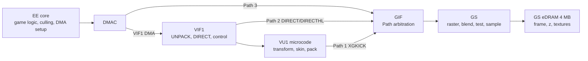

# PlayStation 2 Rendering Techniques and Engine Optimisation for Maximum Throughput

## Executive summary

The fastest PlayStation 2 renderers were not designed like PC-era “GPU drivers”. They were designed like streaming systems. The Emotion Engine usually performed scene management, visibility work, packet assembly and DMA orchestration; VIF1 unpacked and staged data; VU1 executed batch-oriented microprogrammes for transform, skinning and packet generation; and the Graphics Synthesizer mostly just rasterised whatever arrived. The hardware pushed developers towards this model because the machine combined only 32 MB of main memory with 4 MB of GS eDRAM, a very small EE cache hierarchy, and tight VU local-store budgets of 4 KB/4 KB on VU0 and 16 KB/16 KB on VU1. Contemporary hardware reporting and Sony manuals also show that the GS link and memory system were extremely fast only when fed in the right granularity: the GS had a dedicated 64-bit, 150 MHz link from the EE side, while the main memory subsystem offered 3.2 GB/s peak, but wasting those paths on tiny batches or unnecessary passes eroded performance quickly. citeturn48view1turn48view2turn40view6turn40view7turn47view1turn47view5

The practical consequence was that production-quality PS2 engines usually reserved **Path 1** for heavy 3D work: VU1 transformed vertices, often prepared screen-space output directly, and emitted GIF packets with `XGKICK`. **Path 3** remained useful for UI, debug rendering, simple effects and small geometry, but shifting too much vertex work onto the EE quickly became a CPU and GIF bottleneck. **Path 2** sat in between as VIF1-to-GIF direct transfer, useful for specialised command and texture flows but still subject to GIF path arbitration and stalls. Open-source PS2 code and reverse-engineered/homebrew renderers broadly follow the same pattern today because the underlying constraints have not changed. citeturn42view1turn42view2turn46view0turn49view0turn14view1turn14view6

The most important optimisation themes were therefore: keep the EE off the per-vertex hot path; batch aggressively in qwords; build long DMA chains; exploit VIF double-buffering; write VU microcode that hides FMAC and division latency; choose GIF packet formats deliberately; use paletted textures where acceptable; respect GS swizzle/page layout; split expensive full-screen operations into tile-like sprite batches; and keep multi-pass lighting, shadowing and post-processing selective. Published PS2 effect papers make the trade-off explicit: Morten Mikkelsen’s DOT3 normal-mapping paper presents a cheaper two-pass variant and a higher-quality four-pass variant, while tri-Ace publicly presented SH lighting and HDR rendering on PS2 as a specialised, carefully engineered technique rather than a “free” baseline. citeturn10search1turn24search1turn24search5turn44view3

If you are designing a renderer for maximum throughput on real PS2 hardware today, the evidence points to one dominant recipe: perform CPU-side scene culling and sort/state reduction on the EE, stream large VIF1 batches into VU1, let VU1 write the final GIF-ready output, use Path 3 sparingly for overlays and exceptional cases, and treat GS VRAM layout as a first-class data problem rather than a post hoc asset-conversion detail. That recipe is the clearest through-line across Sony manuals, PS2-era performance material, effect papers, ps2tek, and modern open-source PS2 codebases. citeturn24search19turn42view2turn43view1turn44view3turn14view1turn20view0turn49view0

## Hardware bottlenecks that dictated PS2 renderers

The PS2’s renderer was shaped by a handful of hard architectural facts. A useful way to read the machine is not “CPU plus GPU”, but **EE core plus DMA/VIF/GIF transport plus VU local stores plus GS eDRAM**.

| Subsystem | Load-bearing constraint | Why it mattered to renderers |
|---|---|---|
| EE core | Early Sony-era materials often describe the EE as a 300 MHz part; later practical analyses generally quote the retail clock as about 294.91 MHz. The EE has a 16 KB instruction cache, 8 KB data cache, and 16 KB scratchpad RAM. citeturn36view3turn8search1turn47view1turn48view4turn47view5 | If the EE does gameplay, visibility, animation, decompression, and vertex transforms all at once, vertex work becomes the first obvious casualty. The small caches and scratchpad strongly reward streaming and careful working-set control. |
| Main memory | 32 MB dual-channel DRDRAM with 3.2 GB/s peak bandwidth. citeturn48view1turn48view0 | Plenty for sequential streaming by 2000-console standards, but not enough to hide poor asset layout or lots of reformatting. |
| DMAC | 10 EE-side DMA channels: VIF0, VIF1, GIF, IPU from/to, SIF0/1/2, SPR from/to. VIF1 can act as GIF Path 2; GIF is Path 3. citeturn41view5 | Rendering performance depended on concurrent transfers and avoiding path contention, not merely on ALU speed. |
| VU0 | 4 KB micro memory + 4 KB data memory; coupled to the EE as COP2. Sony’s VU manual characterises it as assisting non-stationary geometry processing. citeturn40view6turn45view0 | Good for macro-mode math acceleration and small micro-mode jobs, but too small to be the main geometry processor for large batches. |
| VU1 | 16 KB micro memory + 16 KB data memory, plus EFU and `XGKICK` connection to GIF. Sony describes it as chiefly in charge of background stationary geometry processing. citeturn40view7turn45view0 | This is the real high-throughput geometry engine, but its local-store limits make batch sizing, mesh slicing and parameter packing central engine concerns. |
| GIF and paths | GIF packets use `PACKED`, `REGLIST`, or `IMAGE` formats; Path 1 and Path 2 are effectively unbuffered at the GIF, while Path 3 has a 16-qword FIFO and can be masked/queued. citeturn42view2turn42view3 | State changes and tiny packets are expensive. Path choice is not just an API choice; it determines where stalls and buffering occur. |
| GS | 4 MB multiported embedded DRAM; 16 parallel pixel processors at 150 MHz; dedicated 64-bit/150 MHz display-list link that contemporary reporting describes as 1.2 GB/s; headline capability figures include ~75 Mpolygons/s small-poly throughput and very high sprite/particle rates, but those are peak conditions. citeturn48view1turn48view2turn48view3turn48view4 | The GS is extremely fast when fed simple work with good locality, but it has no shader core and very little VRAM. Fill-rate and bandwidth are abundant only if you avoid repeated passes, poor VRAM placement and cache-hostile full-screen draws. |
| Texture state | `TEX0` encodes texture format, alpha mode, colour combine mode, CLUT base/format, and texture width/height as log2 values; `TEX1` controls LOD and mipmapping policy; `TEXFLUSH` is required after new texture/CLUT uploads or render-to-texture reuse. citeturn43view1 | Texture format choice, CLUT churn, mip storage, and power-of-two sizing directly affect both image quality and whether effects fit inside 4 MB. |

A concise summary of the datapath is below.



This diagram is a compression of Sony’s EE/VU documentation, ps2tek’s path/DMAC descriptions, and the way contemporary and modern PS2 rendering code is organised. citeturn45view0turn41view5turn42view2turn14view6turn49view0

Two architectural details are especially easy to underestimate. First, the EE’s **uncached accelerated mode** uses a dedicated UCAB and an 8-qword write-back buffer, so sequential streaming and burst-like stores can be materially cheaper than cache-polluting random writes; that is one reason PS2 engines leaned so hard into DMA-friendly command and vertex staging. Second, the EE scratchpad can be accessed by DMA while the CPU continues executing, which makes it valuable as a staging area for matrices, animation data, packet templates and decompression intermediates. citeturn47view4turn47view5

Key primary/source URLs used in this section:

```text
https://docs.alexrp.com/mips/ee.pdf
https://docs.alexrp.com/mips/ee_vu.pdf
https://www.cecs.uci.edu/~papers/mpr/MPR/19990419/130501.pdf
https://psi-rockin.github.io/ps2tek/
https://www.copetti.org/writings/consoles/playstation-2/
```

## Fast rendering pipelines that shipped on PS2

The PS2’s “rendering pipeline” was really a family of transport-and-processing patterns. The most useful distinction is by GIF path.

| Pipeline | Typical producer | Strength | Main cost |
|---|---|---|---|
| **Path 3** | EE transforms/assembles final screen-space data, then sends it over the GIF DMA channel. citeturn49view0turn14view0turn14view1 | Simplest programming model; ideal for UI, debug draws, simple full-screen quads, and low-complexity homebrew 3D. | EE pays the transform/lighting cost; GIF path is shared with texture uploads and other direct GS traffic. |
| **Path 2** | EE streams data into VIF1, which forwards `DIRECT` / `DIRECTHL` data to GIF. If Path 2 cannot take GIF control, VIF1 stalls. citeturn42view1 | Useful for VIF-centric workflows, hybrid renderers, or controlled command/texture forwarding through VIF1. | Still limited by GIF arbitration and VIF-side stall behaviour; easier to misuse than Path 3. |
| **Path 1** | EE streams batch data to VU1; VU1 microcode transforms and writes GIF-ready output, then issues `XGKICK`. citeturn46view0turn20view0turn49view0 | Highest ceiling for large opaque 3D batches; frees the EE and often leaves GIF Path 3 available for other jobs. | Most complex to author; local memory limits batch size; `XGKICK` timing hazards matter. |

In the strongest PS2 pipelines, the EE becomes a **stream orchestrator**, not a software T&L unit. It culls scene chunks, chooses LODs, sorts by material/state, fills one command buffer while another is being DMA’d, uploads constants and vertex blocks through VIF1, and then lets VU1 do the repeated arithmetic. Modern open-source PS2 code reflects this directly: PANTHEON describes the EE as sequencing DMA/VIF work while VU1 transforms vertices, builds GIF packets and fires `XGKICK`; Lampert’s Quake II PS2 article describes the same design shift as the difference between a CPU-bound Path 3 renderer and a VU1-accelerated VU/GIF path. citeturn14view6turn19view0turn49view0

VU0 fits into this picture as an auxiliary accelerator rather than the main geometry path. Sony’s VU manual states that VU0 is joined to the EE as COP2 and is intended to assist non-stationary geometry; Lampert’s account gives the practical developer version of that: use VU0 macro mode to accelerate matrix and vector maths inside an EE-heavy path, but rely on VU1 when you need real scaling on vertex throughput. Tyra’s engine documentation reflects the same split: VU0 as inline-assembly helper, VU1 as DMA-fed programmable geometry processor. citeturn40view6turn49view0turn14view5

The path model also clarifies how PS2 engines mixed subsystems inside a frame. World geometry and skinned characters typically belong on Path 1; command-like UI and simple overlays fit naturally on Path 3; some texture or control flows make sense on Path 2; and background streaming, decompression and command generation overlap through DMAC as long as you avoid path fights. Ps2tek’s path description is especially important here: Path 3 can be masked and has a FIFO, whereas Path 1 and Path 2 do not have equivalent buffering at the GIF. That means Path 3 can be used as a queueable transport for some deferred texture work, while Path 1/2 need cleaner timing discipline. citeturn42view2turn41view5

One practical warning: nomenclature in older homebrew and blog material is not always consistent. Some authors use “Path Two rendering” to mean “VU1-based rendering” in a broad sense, while the hardware reference distinction is specifically about **GIF Path 2**, which is VIF1 `DIRECT`/`DIRECTHL`. In this report I use the hardware meaning for Path 1/2/3 and describe “VU1-driven rendering” separately where needed. That resolves otherwise confusing discussions in the secondary literature. citeturn42view1turn42view2turn49view0

Representative URLs for the pipeline patterns discussed here:

```text
https://psi-rockin.github.io/ps2tek/
https://github.com/ps2dev/ps2sdk/blob/master/ee/graph/samples/graph.c
https://github.com/ps2dev/ps2sdk/blob/master/ee/draw/samples/cube/cube.c
https://github.com/94BILLY/PANTHEON
https://glampert.com/2016/01-22/q2ps2-hardware-accelerated-vertex-xform/
```

## Engine optimisation patterns and their trade-offs

A rigorous PS2 renderer is an exercise in **matching the optimisation to the real bottleneck**. The same machine can be CPU-bound, VU-bound, GIF-bound, GS fill-bound, or VRAM-capacity-bound depending on the frame.

| Technique | What it usually saves | Hidden cost or failure mode |
|---|---|---|
| Move transform/lighting/skinning from EE to VU1 | EE time and often GIF Path 3 pressure. citeturn49view0turn40view7 | Harder tooling, batch-size pressure from VU1’s 16 KB/16 KB local store, and `XGKICK` timing hazards. citeturn46view0 |
| Use VU software pipelining and paired upper/lower instructions | Better arithmetic utilisation; hides FMAC/div latency. Sony’s VU manual explicitly describes the LIW model and unified FMAC latencies. citeturn40view6turn45view1 | More fragile code; branches and hazards can create stalls if results are consumed too early. citeturn45view1 |
| Double-buffer packet memory and VIF buffers | CPU/DMAC overlap; less dead time while packets are sent. Ps2sdk’s cube sample flips between two packets while DMAC works. citeturn14view1 | Extra memory footprint and synchronisation complexity. |
| Use VIF1 BASE/OFST double-buffering | Lets VIF/VU1 stream into alternating memory windows; ps2tek shows the DBF toggle between `BASE` and `BASE + OFST`. citeturn44view3 | Easy to corrupt data if unpack layout, packet size, or microcode assumptions drift. |
| Prefer large DMA chains and long GIF packets | Lower per-batch overhead; fewer path arbitrations and fewer state changes. citeturn42view3turn14view1 | Higher latency to first pixel if the engine over-batches; harder partial updates. |
| Choose GIF format per workload: `PACKED`, `REGLIST`, `IMAGE` | Best-format wins on bandwidth and convenience: `PACKED` for mixed registers, `REGLIST` for homogeneous streams, `IMAGE` for raw VRAM transfer via `HWREG`. citeturn42view3turn42view2turn14view2 | Wrong format can waste bandwidth or force awkward packet layouts. |
| Use CLUT textures (`PSMT8`, `PSMT4`) when acceptable | Huge VRAM savings versus 32-bit textures, often decisive inside 4 MB. `TEX0`/`TEX2` explicitly support colour-indexed formats and CLUT control. citeturn43view1 | Palette management, CLUT cache reloads, precision loss, and the need to `TEXFLUSH` when changing data. citeturn43view1 |
| Use mipmaps selectively | Reduced shimmer and better minification quality; the GS supports several mip filtering modes. citeturn43view1 | More VRAM, more upload traffic, more state, and little benefit on near-camera or short-lived textures. |
| Respect GS swizzle/page layout for full-screen work | Dramatically better locality. Ps2tek notes that single huge screen sprites are slow and that splitting into many 64×32 sprites improves cache locality. citeturn44view3turn44view5 | More sprite setup and slightly more packet traffic; but on the GS this is often still faster overall. |
| Use recursive drawing and channel shuffle sparingly | Makes post-processing possible despite no programmable pixel shader. Ps2tek documents recursive drawing and channel shuffle explicitly. citeturn44view3 | Very fill/bandwidth heavy. Ps2tek gives a concrete example: a 640×224 shuffle can require 8,960 8×2 sprites for a single pass. citeturn44view3 |
| Aggressive CPU-side culling, LOD and mesh slicing | Saves VU work, GIF traffic and GS fill together. Inference is strongly supported by VU local-store limits, PS2 clipping/performance talks, and open-source engines such as PANTHEON auto-slicing meshes into VU-safe chunks. citeturn40view7turn24search19turn19view0 | More CPU scene-management work and more complicated content pipelines. |

The single most important strategic choice is **where vertex work lives**. Path 3 renderers keep transforms on the EE and are therefore easy to write, but both Sony-era and modern practical sources show why they stop scaling: the EE is not very fast by later standards, and the same side of the machine is already busy with gameplay, simulation, streaming and packet generation. Moving transform/light/skin work to VU1 both frees the EE and moves the result-production stage closer to `XGKICK`, which reduces transport friction. citeturn49view0turn40view7turn20view0

Inside VU microcode, the winning pattern is to **pair arithmetic and housekeeping**. Sony’s VU manual makes the architectural reason clear: each micro instruction is a long instruction word with an upper floating-point slot and a lower integer/division/control slot, and the FMAC family is designed for pipelined use with a unified latency. In practice, this means a transform loop should load the next vertex, issue the matrix multiply as FMAC/MADD instructions, start the reciprocal divide, do integer address updates or stores while the divide resolves, then perform fixed-point conversion only at the end when the output is ready for GS consumption. citeturn40view6turn45view1turn20view0

`XGKICK` timing is another non-negotiable detail. Sony’s VU manual and ps2tek both note that a second `XGKICK` launched before the previous Path 1 transfer has drained will stall subsequent execution. That means a fast engine generally writes one sizable GS packet into VU memory and kicks it once, rather than streaming lots of tiny kicks. It is one of the clearest examples of the PS2 rewarding coarse granularity. citeturn46view0turn39view5turn42view0

On the transport side, **double-buffering** matters at several levels. Ps2sdk’s cube sample does the simplest, most transferable version: maintain two packet buffers, submit one through the GIF DMAC, flip the packet pointer, and prepare the next packet while DMAC and GS are busy. VIF1 hardware also has its own double-buffer semantics through `BASE`, `OFST` and the DBF flag, letting you alternate unpack destinations in VU memory. Triple-buffering certainly existed in shipping engines for some resource and frame-management problems, but the accessible source material reviewed here more directly and consistently demonstrates **double** buffering as the baseline, especially for command and packet streams. citeturn14view1turn44view3

For textures, the 4 MB GS eDRAM is so small that **format choice is architecture**, not polish. `TEX0` shows why: format, CLUT base and format, alpha interpretation, colour combine function, and `TW`/`TH` style log2 size fields all live in one controlling register. Paletted textures can radically improve fit rates, but CLUT updates incur real state and cache-management work, and the GS texture cache must be flushed when newly transferred texture/CLUT data is reused. Likewise, mipmaps do exist, but every extra level costs scarce VRAM and upload time; on PS2 they should be deployed where aliasing and texture re-use justify them, not as a blanket policy. citeturn43view1

For culling, LOD, instancing and skinning, the manuals give the machine limits and the open code shows the engineering response. Sony’s VU documentation explains how little local store VU1 has, and modern open PS2 renderers respond by slicing meshes to fit predictable working sets; PANTHEON, for example, documents automatic partitioning into VU1-safe batches and uses tiled instancing as a first-class strategy. From that evidence, a conservative inference follows: good PS2 engines try to make the **batch** the stable unit of execution, not the object or draw call in the PC sense. CPU-side culling and LOD selection exist primarily to preserve that batch regularity. citeturn40view7turn19view0

Particles are the place where the GS can look almost absurdly strong, at least in peak form. Contemporary reporting quotes very high sprite and particle rates for the GS, which explains why billboard-heavy effects and sprite-based techniques remained attractive throughout the generation. The catch is that real particle systems still consume path bandwidth, texture bandwidth, blending bandwidth and overdraw, so the GS’s impressive peak numbers are easiest to see when the particles are simple, well-sorted and texture-friendly. citeturn48view3turn48view4

Shadows and post-processing deserve a careful, qualified reading. The source set retrieved here includes no single canonical “PS2 shadowing recipe”, so any one-size-fits-all claim would be overstated. What is well supported is the underlying trade-off: the GS can do sophisticated multi-pass framebuffer and texture tricks, but each extra pass consumes scarce fill and memory bandwidth. Ps2tek’s recursive drawing and channel-shuffle notes show how much work some post effects really cost, Mikkelsen’s DOT3 paper explicitly compares two-pass and four-pass normal mapping solutions, and tri-Ace’s SH/HDR talk demonstrates that higher-end lighting/post systems were feasible only through specialised engineering. The safe conclusion is that **projected shadows, blob shadows, selective render-to-texture passes, and carefully bounded post effects** are PS2-friendly; blanket multi-pass lighting across the whole frame usually is not. citeturn44view3turn10search1turn24search1turn24search5

Useful URLs for the optimisation topics above:

```text
https://docs.alexrp.com/mips/ee_vu.pdf
https://docs.alexrp.com/mips/ee.pdf
https://psi-rockin.github.io/ps2tek/
https://mmikk.github.io/papers3d/ps2_normalmapping.pdf
https://research.tri-ace.com/
https://github.com/94BILLY/PANTHEON
https://github.com/ps2dev/ps2sdk/blob/master/ee/draw/samples/cube/cube.c
```

## Practical packet and microcode examples

The examples below are **illustrative and simplified**, but each one is grounded in concrete PS2 source material rather than invented syntax. I have adapted them to stay short and readable, while preserving the architectural pattern that matters.

An illustrative **GIF packet builder** for a textured triangle batch looks like this. It combines the field layout documented by ps2tek with the `GIF_TAG`/register-constructor idioms exposed in gsKit. citeturn42view3turn14view2

```c
// Illustrative helper based on gsKit/ps2tek field layout.
static inline uint64_t giftag(
    uint16_t nloop, int eop, int pre, uint16_t prim, uint8_t flg, uint8_t nreg) {
  return ((uint64_t)nloop) |
         ((uint64_t)eop  << 15) |
         ((uint64_t)pre  << 46) |
         ((uint64_t)prim << 47) |
         ((uint64_t)flg  << 58) |
         ((uint64_t)nreg << 60);
}

void build_textured_tri_batch(uint64_t* q, int vertex_count) {
  // One primitive stream: RGBAQ, ST, XYZ2.
  q[0] = giftag(vertex_count, 1, 0, 0, /*PACKED=*/0, /*NREG=*/3);
  q[1] = (0x01ull) | (0x02ull << 4) | (0x05ull << 8); // RGBAQ, ST, XYZ2

  // Followed by vertex_count groups of:
  //   RGBAQ quadword
  //   ST quadword
  //   XYZ2 quadword
  //
  // In a Path 3 renderer the EE writes these directly.
  // In a Path 1 renderer VU1 writes the same layout into local memory.
}
```

For **packet-level overlap**, ps2sdk’s sample code demonstrates the canonical pattern: keep two packet buffers and swap them so DMAC can push one while the CPU fills the other. The point is not merely “double-buffering”, but **overlapping CPU packet generation with DMAC and GS work**. citeturn14view1

```c
packet_t* packets[2] = {
  packet_init(MAX_QWORDS, PACKET_NORMAL),
  packet_init(MAX_QWORDS, PACKET_NORMAL)
};

int ctx = 0;

for (;;) {
  packet_t* cur = packets[ctx];
  uint64_t* q = cur->data;

  q = build_scene_packet(q, scene_state);

  dma_channel_send_chain(
      DMA_CHANNEL_GIF,
      cur->data,
      q - cur->data,
      0, 0);

  // Important: prepare the next packet while DMAC/GS consume this one.
  ctx ^= 1;

  draw_wait_finish();
  graph_wait_vsync();
}
```

For **VU1 microcode**, the essential pattern is “load constants, transform, divide, convert late, store opcode-ready output, kick once”. The short snippet below is adapted from the same ideas visible in PANTHEON’s `shader.vsm` and Lampert’s VU1 example: matrix rows are loaded up front, the perspective divide is issued early and waited on once, RGBA/ST/XYZ output are written in the packet order expected by the GS, and `XGKICK` happens only after the packet is complete. citeturn20view0turn21view0turn33view5turn49view0

```asm
; Illustrative VU1 microprogram pattern.
; Input layout:
;   4..7   MVP rows
;   8..    vertices
;   240    GIFtag
;   241..  output packet area

    lq      VF01, 4(VI00)      ; MVP row 0
    lq      VF02, 5(VI00)      ; MVP row 1
    lq      VF03, 6(VI00)      ; MVP row 2
    lq      VF04, 7(VI00)      ; MVP row 3
    lq      VF06, 240(VI00)    ; GIFtag
    sq      VF06, 240(VI00)

    iaddiu  VI02, VI00, 8      ; input cursor
    iaddiu  VI03, VI00, 241    ; output cursor

vertex_loop:
    lq      VF08, 0(VI02)      ; position
    iaddi   VI02, VI02, 1

    mulax   ACC,  VF01, VF08x
    madday  ACC,  VF02, VF08y
    maddaz  ACC,  VF03, VF08z
    maddw   VF10, VF04, VF08w  ; clip/proj space

    div     q, VF00w, VF10w
    waitq
    mulq.xyzw VF10, VF10, q    ; perspective divide

    ; ... screen-space scaling and fixed-point conversion here ...
    ; ... store RGBAQ, ST, XYZ2 in GIF order ...

    b       vertex_loop
    nop

end:
    iaddiu  VI04, VI00, 240
    xgkick  VI04
    nop[E]  nop
```

The important microcode lesson is not the exact register naming, but the **shape of the work**. Constants are front-loaded; FMAC-heavy matrix work is sequenced to keep the pipeline busy; the divide is overlapped where possible; and output is written in **GIF-native order** so the GS consumes it without extra EE mediation. That is the central optimisation insight of Path 1 rendering on PS2. citeturn40view6turn46view0turn49view0

Several open repositories are particularly useful if you want working source, packet layouts, and real-world assembly/tooling examples rather than only theory:

| Repository or source | Why it is valuable |
|---|---|
| `https://github.com/ps2dev/ps2sdk` | Core homebrew SDK; includes simple `graph` and `draw` samples that show GIF setup, DMA submission and buffer management. citeturn14view0turn14view1 |
| `https://github.com/ps2dev/gsKit` | Low-level GS helper library; exposes concrete GIF tag and GS register-construction idioms. citeturn14view2 |
| `https://github.com/94BILLY/PANTHEON` | Modern Path 1 reference project with readable `shader.vsm`, mesh slicing and VU1-driven world rendering. citeturn19view0turn20view0 |
| `https://github.com/h4570/tyra` | Practical engine documentation showing the EE/VU0/VU1/GS role split used by current PS2 homebrew engine work. citeturn14view5 |
| `https://github.com/ps2dev/ps2gl` | Useful negative example as well as positive: its own documentation explains that much of full OpenGL is a poor fit for PS2 and would require undesirable software emulation. citeturn14view4 |

Additional source URLs directly referenced in this section:

```text
https://github.com/ps2dev/ps2sdk/blob/master/ee/draw/samples/cube/cube.c
https://github.com/ps2dev/ps2sdk/blob/master/ee/graph/samples/graph.c
https://github.com/ps2dev/gsKit/blob/master/ee/gs/include/gsInit.h
https://github.com/94BILLY/PANTHEON/blob/main/shader.vsm
https://raw.githubusercontent.com/94BILLY/PANTHEON/main/shader.vsm
https://glampert.com/2016/01-22/q2ps2-hardware-accelerated-vertex-xform/
https://github.com/ps2dev/ps2gl
https://github.com/h4570/tyra
```

## Technique comparison and evidence-backed recommendations

The table below pulls the evidence together into a decision framework. It is meant as a practical “what should I do if this is my bottleneck?” map.

| If the bottleneck is… | Prefer | Usually avoid | Why |
|---|---|---|---|
| EE time spent on vertex work | Move transform/light/skin into VU1 Path 1; use VU0 only as a helper for small hot maths. citeturn49view0turn40view7turn14view5 | Large Path 3 worlds with dynamic lighting on the EE. citeturn49view0 | The EE is too valuable as the scheduler/visibility/streaming processor to waste on bulk vertex loops. |
| GIF/channel contention | Keep world geometry on Path 1; use Path 3 for overlays and exceptional cases; exploit Path 3 masking/FIFO where appropriate. citeturn42view2turn46view0 | Tiny mixed packets from every subsystem every frame. | The PS2 performs best when packet granularity is large and transport responsibilities are partitioned. |
| VU1 stalls or poor batch throughput | Software-pipeline microcode, reduce branches/hazards, kick once per batch, slice meshes to fit local store. citeturn45view1turn46view0turn19view0 | Repeated back-to-back `XGKICK` or oversized monolithic batches. | VU1’s arithmetic is powerful, but only when local-store layout and timing are disciplined. |
| GS fill-rate or full-screen pass cost | Lower pass count, use fast screen draws in 64×32 tiles, prefer selective effects. citeturn44view3turn44view5 | Giant single full-screen sprites and blanket multi-pass post. | The GS’s non-linear memory layout punishes naïve full-screen operations. |
| VRAM capacity | CLUT textures, selective mipmaps, lower-resolution intermediate buffers, explicit texture lifetime control. citeturn43view1 | Defaulting to 32-bit RGBA textures everywhere. | Inside 4 MB, format discipline matters more than on contemporary PC GPUs. |
| Fancy lighting ambition | Restrict advanced effects to hero assets or bounded passes; accept approximation. Published examples on PS2 include two-pass and four-pass DOT3 variants, and specialised SH/HDR work. citeturn10search1turn24search1turn24search5 | Whole-scene high-pass-count lighting as a baseline. | Multi-pass visual sophistication is possible on PS2, but not free. |

The clearest, evidence-backed recommendations are therefore these.

A fast PS2 engine should treat the **batch** as its primary optimisation unit. That means offline asset conditioning, VU-friendly mesh slicing, material sorting, and culling/LOD decisions that preserve batch coherence rather than fighting it. The local-store sizes in Sony’s VU manual, plus the real Path 1 code patterns in projects like PANTHEON, support that conclusion strongly. citeturn40view7turn19view0turn20view0

A fast PS2 engine should also treat **memory layout as part of rendering**, not asset packaging. Texture format, CLUT policy, `TW`/`TH` sizing, framebuffer/zbuffer placement, and swizzle-aware full-screen operations all influence performance as directly as state sorting or arithmetic throughput. Ps2tek’s detailed GS notes are especially valuable here because they connect high-level engine choices to the GS’s actual page layout and cache behaviour. citeturn43view1turn44view3turn44view5

Finally, a fast PS2 engine should profile transport and overlap, not just arithmetic. Sony’s Performance Analyzer material exists precisely because the hard cases are often not “how many multiplies can I do?” but “which unit is waiting, which path is blocked, and what is fighting for the GIF?” On PS2, a renderer can be mathematically efficient and still slow if its packetisation and path scheduling are poor. citeturn24search19turn41view5turn42view2

Representative primary, talk, and source-code URLs used throughout this report:

```text
https://docs.alexrp.com/mips/ee.pdf
https://docs.alexrp.com/mips/ee_vu.pdf
https://docs.alexrp.com/mips/ee_insns.pdf
https://www.cecs.uci.edu/~papers/mpr/MPR/19990419/130501.pdf
https://psi-rockin.github.io/ps2tek/
https://mmikk.github.io/papers3d/ps2_normalmapping.pdf
https://research.tri-ace.com/
https://gdcvault.com/play/1022721/Squeezing-Every-Last-Drop-Out
https://github.com/ps2dev/ps2sdk
https://github.com/ps2dev/gsKit
https://github.com/ps2dev/ps2gl
https://github.com/94BILLY/PANTHEON
https://github.com/h4570/tyra
https://glampert.com/2016/01-22/q2ps2-hardware-accelerated-vertex-xform/
```

